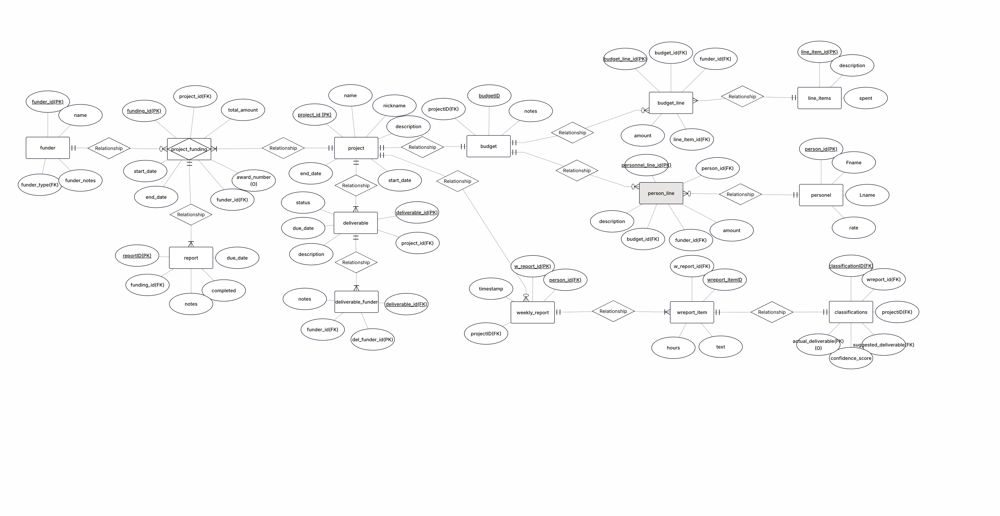
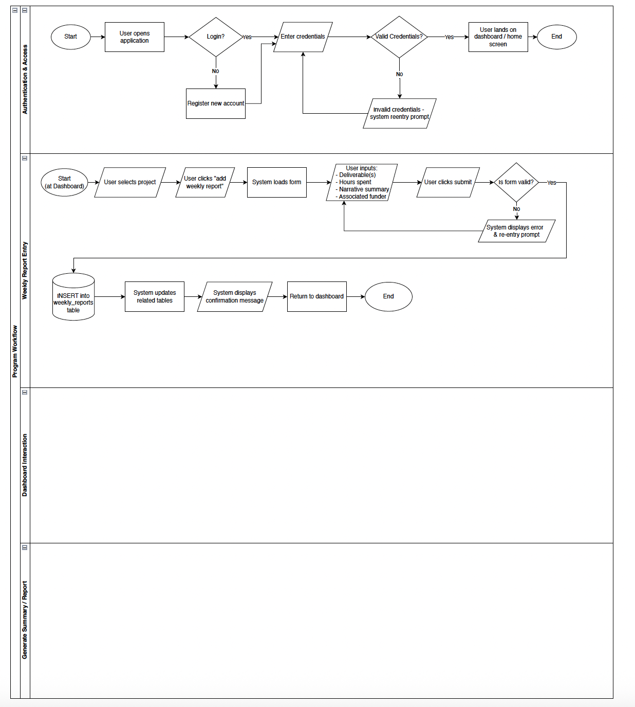

# Task 1 - Project Proposal

## Proposal

### Team Members
Christine Voyer  
Ian Duggan  
Alison Avery  

### Project Description
The longterm idea is to build an AI-powered grant management platform that synthesizes weekly narrative reports and personel hours tracking into organized draft report materials and budget reports.

#### Purpose and Rationale
Before coming to the Roux, I had worked for 12 years at a medium sized non-profit as a program manager. Managing the reporting and budget tracking working with budgets composed with funds from across a patchwork of funding sources, from tiny local foundations to large federal agencies was a huge time sink, even in an organization with significant capacity in accounting and development. In addition, the many systems used across the many departments to track progress and spending were rarely aligned, and the tools and systems were largely siloed. 

Funder reporting requirements may be seen as a burden (federal reporting requirements especiall), but the solution isn't less accountability. The solution is better (fewer) tools. Funders deserve to know their money is being spent appropriately and achieving outcomes and/or contributing new knowledge. The burden comes from using disconnected systems that create manual work and friction points. I am proposing a tool that puts everything in one place and leverages already existing tools like task management tools and weekly check ins to quickly capture the relevant information about the work.

#### Target Users
- Research institutions (universities, labs)
- Non-profits managing federal/foundation grants
- Any organization with documentation-heavy funding sources

#### Problem Statement
Managing federal awards and similar funding requires tracking:
- Budget spending vs. approved amounts across multiple categories
- Personnel effort allocation and compliance with approved amounts
- Progress on deliverables and specific aims
- Regular reporting to funders with different requirements

Currently, these elements exist in separate systems (email updates, spreadsheets, accounting software, project management tools, development databases). Project managers and other organization staff spend hours manually synthesizing information into reports.

### Technical Overview Tentative plans
#### Backend
Runtime Environment: Node.js  
API Architecture: RESTful API design pattern  
Server Framework: Express.js  
Database: PostgreSQL   
 
#### Frontend
Build Tool: Vite   
Technologies:  
* HTML for structure  
* CSS for styling  
* Bootstrap framework for UI components  
* Vanilla JavaScript   

### Database Design

### User Workflow

